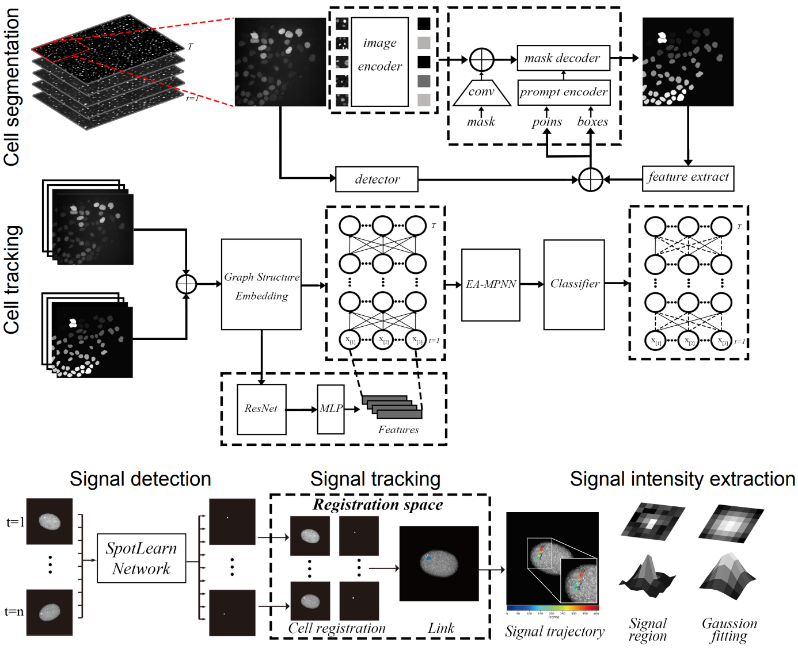

# Cell tracking and Transcription sites detection

This codebase is the implementation for the paper "Real-time atlas of nascent RNA kinetics elucidates integrated principles of transcription dynamics".



## System Requirements

The code has been tested on:

- Red Hat 8.3.1-5 with CUDA 11.7 (Nvidia L40)
- Ubuntu 18.04 with CUDA 12.2 (Nvidia GeForce RTX 4090)

## Environment Setup

Cell segmentation and tracking requires seperate conda environment, with `cell-seg.yml` and `cell-track.yml` files provided for each setup.

For cell segmentation, run the following commands to create and install the environment:

```bash
cd cell_track
conda env create -f cell-seg.yml
conda activate sam-yolo
cd bash/segment-anything
pip install -e .
```

**Troubleshootings**: If there's any issue with `mmcv` package in usage, suggested to reinstall `mmcv` using `mim` instead of `pip`:

```bash
pip uninstall mmcv
mim install "mmcv==2.0.1"
```

For cell tracking, run the following commands to create and install the environment:

```bash
cd cell_track
conda env create -f cell-track.yml
conda activate celltrack
```

**Tips**: Environment installation may take a few minutes, depending on your network speed and installation source.

## Cell Segmentation and Tracking

Please refer to to [README](/cell_track/README.md) for more details.

## Transcription sites Analysis

Please refer to to [README](/site_flow/README.md) for more details.

## License

This project is covered under the **Apache 2.0 License**.